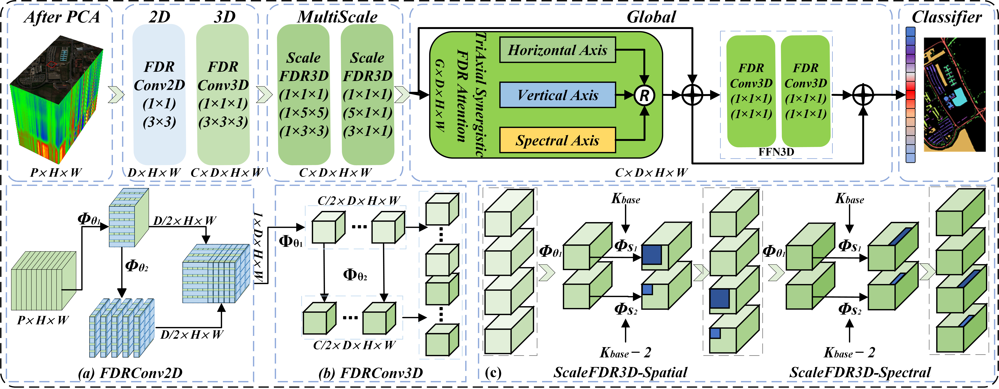

# Ultralightweight Progressive Feature Disentanglement and Recomposition Network for Hyperspectral Image Classification

## Introduction

The repository for this project is the code implementation of the paper *Ultralightweight Progressive Feature Disentanglement and Recomposition Network for Hyperspectral Image Classification*.

If you find this project helpful, please give us a star ⭐️.

## Abstract

> **Deep Learning-based Hyperspectral Image Classification (DL-HSIC) demands more discriminative spatial-spectral representation while maintaining a balance between computational practicality and classification performance. However, the high computational complexity and massive trainable parameters of DL-HSIC impede the optimal balance. To address these limitations, a novel Ultralightweight Progressive Feature Disentanglement and Recomposition Network (ULite-FDRNet) is proposed in this study, which notably achieves balanced optimization of representation capability, parameter efficiency, and classification performance. Based on the Feature Disentanglement and Recomposition paradigm (FDR), we design Ultralight FDR 2D/3D Convolution (FDRConv2D/3D), Ultralight Axial Multiscale FDR 3D Convolution (ScaleFDR3D), and TriAxial Synergistic FDR Attention Module (TriSFDR). Specifically, the FDRConv2D/3D performs a spatial-spectral disentanglement, focusing on shallow spatial detail features while preserving the spectral dependency information. In addition, ScaleFDR3D adds different scales of information to the spatial-spectral decoupling features and disentangles different ranges of features by axial-sensitive kernels and a scale-decreasing strategy. Ultimately, TriSFDR disentangles attention into vertical, horizontal, and spectral three independent axes to acquire spatial global attention and spectral coarse-fine-grained attention. The proposed modules construct progressive feature learning from 2D to 3D to Multiscale to Global, while significantly reducing parameters. Extensive experiments conducted on four HSI benchmarks demonstrate that the proposed ULite-FDRNet maintains superior accuracy while providing an optimal solution in terms of parameter efficiency and representational capability. Specifically, ULite-FDRNet achieves about 98.24%, 97.83%, 97.47%, and 99.53% accuracies with parameters of 1.93 K, 2.04 K, 3.50 K, and 0.86 K respectively. Compared with the standard 2D and 3D convolutions, the proposed FDRConv2D/3D reduces the parameters by 93.66% and 42.97% respectively. ScaleFDR3D effectively maintains multiscale information while reducing parameters by 80%. TriSFDR achieves a linear complexity of *O*(*D*) with fewer parameters.**



> Fig. 1. The detailed architecture of the proposed ULite-FDRNet for HSI classification.

## Repository 's Structure

```
ULite_FDRNet/
├── checkpoints/
│   └── /...
│   └── README.md		<-- Detailed information is here
├── datasets/
│   └── /...
│   └── README.md		<-- Detailed information is here
├── models/
│   └── /...
│   └── README.md		<-- Detailed information is here
├── myPlot/
│   └── HSIcubePlot		<-- plot HSI cube
├── results/
│   └── /...
│   └── README.md		<-- Detailed information is here
├── utils/
│   └── /...
│   └── README.md		<-- Detailed information is here
├── wandbtest/
│   └── Mywandb_test.py	<-- use wandb to fine-tune 
├── eval.py				<--	inference
├── main.py				<-- main
├── README.md
├── requirements.txt
└── train.py			<-- train/test/val etc.
```

## Models

**The comparison method in the article:**

```
# =============================== Non Lite:===============================
# A2S2K(TGRS 2021), SSFTT(TGRS 2022), morphFormer(TGRS 2023), LRDTN(TGRS 2024), CSCANet(TIP 2025, pca=30), S2VNet(TGRS 2025)
# =============================== lite:===============================
# LS2CM(LGRS 2021), ELS2T(TGRS 2023), LMSS_NAS(TGRS 2023), CLOLN(TGRS 2024), ACB(TGRS 2024)
```

Other detailed information is in [README](https://github.com/DelonKong/ULite_FDRNet/blob/main/models/README.md)

## Datasets

#### IP, SV, PC, PU, KSC, BS

**Indian Pines(IP), Salinas(SV), Pavia Centre and University(PC, PU), Kennedy Space Center (KSC), Botswana(BS)**

Available at: [Hyperspectral Remote Sensing Scenes - Grupo de Inteligencia Computacional (GIC)](https://www.ehu.eus/ccwintco/index.php/Hyperspectral_Remote_Sensing_Scenes)

#### WHU-Hi dataset

**WHU-HH, WHU-HC, WHU-LK**

Available at: https://rsidea.whu.edu.cn/resource_H2.htm

#### University of Houston (HsU)

Available at: [2018 IEEE GRSS Data Fusion Challenge – Fusion of Multispectral LiDAR and Hyperspectral Data – Machine Learning and Signal Processing Laboratory](https://machinelearning.ee.uh.edu/2018-ieee-grss-data-fusion-challenge-fusion-of-multispectral-lidar-and-hyperspectral-data/)

#### HyRANK(HRL) 

Available at: [HyRANK Hyperspectral Satellite Dataset I](https://zenodo.org/records/1222202#.Y4HMrX1Bxdi)

#### ShanDongFeiCheng (SDFC)

Available at: [SDFC dataset: a large-scale benchmark dataset for hyperspectral image classification | Optical and Quantum Electronics](https://link.springer.com/article/10.1007/s11082-022-04399-9)

**The datasets used in the article:**


Other detailed information and download link is in [README](https://github.com/DelonKong/ULite_FDRNet/blob/main/datasets/README.md)

## TODO

- [ ] we'll open source the ULite-FDRNet code after the article is accepted.

# References & Acknowledgement

Some of our codes references to the following projects, and we are thankful for their great work:

## 2025:

[1] B. Zhang, Y. Chen, S. Xiong, and X. Lu, “Hyperspectral Image Classification via Cascaded Spatial Cross-Attention Network,” *IEEE Transactions on Image Processing*, vol. 34, pp. 899–913, 2025, doi: [10.1109/TIP.2025.3533205](https://doi.org/10.1109/TIP.2025.3533205).

Based on [[**Code**]]( https://github.com/WUTCM-Lab/CSCANet) by [Bo Zhang](https://ieeexplore.ieee.org/author/37090021617). No explicit license was provided. If there is any infringement, please contact me

[2] Z. Han, J. Yang, L. Gao, Z. Zeng, B. Zhang, and J. Chanussot, “Subpixel Spectral Variability Network for Hyperspectral Image Classification,” *IEEE Transactions on Geoscience and Remote Sensing*, vol. 63, pp. 1–14, Jan. 2025, doi: [10.1109/TGRS.2025.3535749](https://doi.org/10.1109/TGRS.2025.3535749).

Based on [[**Code**]]( https://github.com/hanzhu97702/S2VNet) by [Zhu Han](https://ieeexplore.ieee.org/author/37088991873), licensed under GPL-3.0.

[3] Z. Chen, S. K. Roy, H. Gao, Y. Ding and B. Zhang, "SiT: Scale-interaction Transformer for Hyperspectral Image Classification," in *IEEE Transactions on Geoscience and Remote Sensing*, doi: 10.1109/TGRS.2025.3598290.

Based on [[**Code**]](https://github.com/zhonghaochen/SiT/tree/main) by [Zhonghao Chen]([Zhonghao Chen - IEEE Xplore Author Profile](https://ieeexplore.ieee.org/author/37088809151)). No explicit license was provided. If there is any infringement, please contact me

[4] Z. Shu, K. Zeng, J. Zhou, Y. Wang, M. Tai and Z. Yu, "Spectral-Spatial Synergy Guided Attention Network for Hyperspectral Image Classification," in *IEEE Transactions on Geoscience and Remote Sensing*, doi: 10.1109/TGRS.2025.3603397.

Based on [[**Code**]](https://github.com/szq0816/DSGAN) by [Zhenqiu Shu](https://ieeexplore.ieee.org/author/37085652490). No explicit license was provided. If there is any infringement, please contact me

## 2024:

[1] Z. Han, J. Yang, L. Gao, Z. Zeng, B. Zhang, and J. Chanussot, “Dual-Branch Subpixel-Guided Network for Hyperspectral Image Classification,” *IEEE Transactions on Geoscience and Remote Sensing*, vol. 62, pp. 1–13, Jun. 2024, doi: [10.1109/TGRS.2024.3418583](https://doi.org/10.1109/TGRS.2024.3418583).

Based on [[**Code**]](https://github.com/hanzhu97702/DSNet)  by  [Zhu Han](https://ieeexplore.ieee.org/author/37088991873), licensed under GPL-3.0.

[2] Y. Cui, L. Zhu, C. Zhao, L. Wang, and S. Gao, “Lightweight Spectral–Spatial Feature Extraction Network Based on Domain Generalization for Cross-Scene Hyperspectral Image Classification,” *IEEE Transactions on Geoscience and Remote Sensing*, vol. 62, pp. 1–14, Aug. 2024, doi: [10.1109/TGRS.2024.3427375](https://doi.org/10.1109/TGRS.2024.3427375).

[Based on [**Code**]]( [https://github.com/zhulongyu1234/ACB/tree/master)) by [Ying Cui](https://ieeexplore.ieee.org/author/37087003911). No explicit license was provided. If there is any infringement, please contact me

[3] C. Li, B. Rasti, X. Tang, P. Duan, J. Li, and Y. Peng, “Channel-Layer-Oriented Lightweight Spectral–Spatial Network for Hyperspectral Image Classification,” *IEEE Transactions on Geoscience and Remote Sensing*, vol. 62, pp. 1–14, Jan. 2024, doi: [10.1109/TGRS.2024.3350055](https://doi.org/10.1109/TGRS.2024.3350055).

[Based on [**Code**]]( https://github.com/AchunLee/CLOLN_TGRS) [Chunchao Li](https://ieeexplore.ieee.org/author/37089424553). No explicit license was provided. If there is any infringement, please contact me

[4] Y. Zhou, X. Huang, X. Yang, J. Peng, and Y. Ban, “DCTN: Dual-Branch Convolutional Transformer Network With Efficient Interactive Self-Attention for Hyperspectral Image Classification,” *IEEE Transactions on Geoscience and Remote Sensing*, vol. 62, pp. 1–16, Feb. 2024, doi: [10.1109/TGRS.2024.3364143](https://doi.org/10.1109/TGRS.2024.3364143).

Based on [[**Code**]]( https://github.com/AllFever/DeepHyperX-DCTN) by [Yunfei Zhou](https://ieeexplore.ieee.org/author/37088665329). No explicit license was provided. If there is any infringement, please contact me

[5] S. Ding *et al.*, “LRDTN: Spectral-Spatial Convolutional Fusion Long-Range Dependency Transformer Network for Hyperspectral Image Classification,” *IEEE Transactions on Geoscience and Remote Sensing*, pp. 1–1, Dec. 2024, doi: [10.1109/TGRS.2024.3510625](https://doi.org/10.1109/TGRS.2024.3510625).

Based on [[**Code**]]( https://github.com/ybyangjing/LRDTN) by[Shujie Ding](https://ieeexplore.ieee.org/author/282249461303877). No explicit license was provided. If there is any infringement, please contact me

[6] D. Kong, J. Zhang, S. Zhang, X. Yu, and F. A. Prodhan, “MHIAIFormer: Multihead Interacted and Adaptive Integrated Transformer With Spatial-Spectral Attention for Hyperspectral Image Classification,” *IEEE Journal of Selected Topics in Applied Earth Observations and Remote Sensing*, vol. 17, pp. 14486–14501, Aug. 2024, doi: [10.1109/JSTARS.2024.3441111](https://doi.org/10.1109/JSTARS.2024.3441111). [[**Code**]]( https://github.com/DelonKong/MHIAIFormer)

## 2023:

[1] F. Zhou, X. Sun, C. Sun, J. Dong, and X. X. Zhu, “Adaptive Morphology Filter: A Lightweight Module for Deep Hyperspectral Image Classification,” *IEEE Transactions on Geoscience and Remote Sensing*, vol. 61, pp. 1–16, Aug. 2023, doi: [10.1109/TGRS.2023.3327418](https://doi.org/10.1109/TGRS.2023.3327418).

Based on [[**Code**]]( https://github.com/zhu-xlab/Adaptive-Morphology-Filter) by [Fei Zhou](https://ieeexplore.ieee.org/author/37086226175). No explicit license was provided. If there is any infringement, please contact me

[2] S. Zhang, J. Zhang, X. Wang, J. Wang, and Z. Wu, “ELS2T: Efficient Lightweight Spectral–Spatial Transformer for Hyperspectral Image Classification,” *IEEE Transactions on Geoscience and Remote Sensing*, vol. 61, pp. 1–16, Aug. 2023, doi: [10.1109/TGRS.2023.3299442](https://doi.org/10.1109/TGRS.2023.3299442).

[3] E. Ouyang, B. Li, W. Hu, G. Zhang, L. Zhao, and J. Wu, “When Multigranularity Meets Spatial–Spectral Attention: A Hybrid Transformer for Hyperspectral Image Classification,” *IEEE Transactions on Geoscience and Remote Sensing*, vol. 61, pp. 1–18, 2023, doi: [10.1109/TGRS.2023.3242978](https://doi.org/10.1109/TGRS.2023.3242978).

Based on [[**Code**]]( https://github.com/zhaolin6/HybridFormer) by [Er Ouyang](https://ieeexplore.ieee.org/author/37089246019). No explicit license was provided. If there is any infringement, please contact me

[4] C. Cao, H. Xiang, W. Song, H. Yi, F. Xiao, and X. Gao, “Lightweight Multiscale Neural Architecture Search With Spectral–Spatial Attention for Hyperspectral Image Classification,” *IEEE Transactions on Geoscience and Remote Sensing*, vol. 61, pp. 1–15, Mar. 2023, doi: [10.1109/TGRS.2023.3253247](https://doi.org/10.1109/TGRS.2023.3253247).

Based on [[**Code**]]( https://github.com/xh-captain/LMSS-NAS) by [Chunhong Cao](https://ieeexplore.ieee.org/author/37271420700). No explicit license was provided. If there is any infringement, please contact me

## 2022:

[1] L. Sun, G. Zhao, Y. Zheng, and Z. Wu, “Spectral–Spatial Feature Tokenization Transformer for Hyperspectral Image Classification,” *IEEE Transactions on Geoscience and Remote Sensing*, vol. 60, pp. 1–14, 2022, doi: [10.1109/TGRS.2022.3144158](https://doi.org/10.1109/TGRS.2022.3144158).

[Based on [**Code**]]( https://github.com/zgr6010/HSI_SSFTT) by [Le Sun](https://ieeexplore.ieee.org/author/38511890600). No explicit license was provided. If there is any infringement, please contact me

[2] R. Song, Y. Feng, W. Cheng, Z. Mu, and X. Wang, “BS2T: Bottleneck Spatial–Spectral Transformer for Hyperspectral Image Classification,” IEEE Transactions on Geoscience and Remote Sensing, vol. 60, pp. 1–17, 2022, doi: 10.1109/TGRS.2022.3185640.

Based on [[**Code**]]( https://github.com/srxlnnu/BS2T) by [Ruoxi Song](https://ieeexplore.ieee.org/author/37086526926). No explicit license was provided. If there is any infringement, please contact me

[3] S. Mei, C. Song, M. Ma, and F. Xu, “Hyperspectral Image Classification Using Group-Aware Hierarchical Transformer,” *IEEE Transactions on Geoscience and Remote Sensing*, vol. 60, pp. 1–14, Sep. 2022, doi: [10.1109/TGRS.2022.3207933](https://doi.org/10.1109/TGRS.2022.3207933).

Based on [[**Code**]]( https://github.com/MeiShaohui/Group-Aware-Hierarchical-Transformer) by [Shaohui Mei](https://ieeexplore.ieee.org/author/37402088800). No explicit license was provided. If there is any infringement, please contact me

## 2021:

[1] D. Hong *et al.*, “SpectralFormer: Rethinking Hyperspectral Image Classification With Transformers,” *IEEE Transactions on Geoscience and Remote Sensing*, vol. 60, pp. 1–15, Feb. 2022, doi: [10.1109/TGRS.2021.3130716](https://doi.org/10.1109/TGRS.2021.3130716).

Based on [[**Code**]](https://github.com/danfenghong/IEEE_TGRS_SpectralFormer) by Danfeng Hong (2021), licensed under GPL-3.0.

[2] S. K. Roy, S. Manna, T. Song, and L. Bruzzone, “Attention-Based Adaptive Spectral–Spatial Kernel ResNet for Hyperspectral Image Classification,” *IEEE Transactions on Geoscience and Remote Sensing*, vol. 59, no. 9, pp. 7831–7843, Sep. 2021, doi: [10.1109/TGRS.2020.3043267](https://doi.org/10.1109/TGRS.2020.3043267).

Based on [[**Code**]]( https://github.com/suvojit-0x55aa/A2S2K-ResNet) by [Swalpa Kumar Roy](https://ieeexplore.ieee.org/author/37086689617). No explicit license was provided. If there is any infringement, please contact me

[3] M. E. Paoletti, J. M. Haut, N. S. Pereira, J. Plaza, and A. Plaza, “Ghostnet for Hyperspectral Image Classification,” *IEEE Transactions on Geoscience and Remote Sensing*, vol. 59, no. 12, pp. 10378–10393, Dec. 2021, doi: [10.1109/TGRS.2021.3050257](https://doi.org/10.1109/TGRS.2021.3050257).

[4] Z. Meng, L. Jiao, M. Liang, and F. Zhao, “A Lightweight Spectral-Spatial Convolution Module for Hyperspectral Image Classification,” *IEEE Geoscience and Remote Sensing Letters*, vol. 19, pp. 1–5, Dec. 2021, doi: [10.1109/LGRS.2021.3069202](https://doi.org/10.1109/LGRS.2021.3069202).

## others:

[1] S. K. Roy, G. Krishna, S. R. Dubey, and B. B. Chaudhuri, “HybridSN: Exploring 3-D–2-D CNN Feature Hierarchy for Hyperspectral Image Classification,” *IEEE Geoscience and Remote Sensing Letters*, vol. 17, no. 2, pp. 277–281, 2020, doi: [10.1109/LGRS.2019.2918719](https://doi.org/10.1109/LGRS.2019.2918719).

Based on [[**Code**]]( https://github.com/gokriznastic/HybridSN) by [Swalpa Kumar Roy](https://ieeexplore.ieee.org/author/37086689617). No explicit license was provided. If there is any infringement, please contact me

[2] A. Ben Hamida, A. Benoit, P. Lambert, and C. Ben Amar, “3-D Deep Learning Approach for Remote Sensing Image Classification,” *IEEE Transactions on Geoscience and Remote Sensing*, vol. 56, no. 8, pp. 4420–4434, Aug. 2018, doi: [10.1109/TGRS.2018.2818945](https://doi.org/10.1109/TGRS.2018.2818945).

Based on [[**Code**]]( https://github.com/nshaud/DeepHyperx) by [Amina Ben Hamida](https://ieeexplore.ieee.org/author/37069950200). No explicit license was provided. If there is any infringement, please contact me

[3] W. Song, S. Li, L. Fang, and T. Lu, “Hyperspectral Image Classification With Deep Feature Fusion Network,” *IEEE Transactions on Geoscience and Remote Sensing*, vol. 56, no. 6, pp. 3173–3184, 2018, doi: [10.1109/TGRS.2018.2794326](https://doi.org/10.1109/TGRS.2018.2794326).

Licensing
---------------------

Copyright (C) 2025 Delong Kong

This program is free software: you can redistribute it and/or modify it under the terms of the GNU General Public License as published by the Free Software Foundation, version 3 of the License.

This program is distributed in the hope that it will be useful, but WITHOUT ANY WARRANTY; without even the implied warranty of MERCHANTABILITY or FITNESS FOR A PARTICULAR PURPOSE. See the GNU General Public License for more details.

You should have received a copy of the GNU General Public License along with this program.
